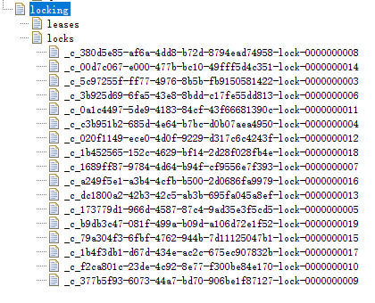

# Distributed Lock Demo
基于Redis，Zookeeper实现分布式锁

## Redis实现分布式锁原理
由于Redis是单线程的，基于命令SETNX（set if not exists）可以实现锁的原理；
当一个key在redis中不存在时；返回1（成功）；
当一个key在redis中存在时；返回0（失败）；

```shell
127.0.0.1:6379> SETNX abc 1
(integer) 1
127.0.0.1:6379> SETNX abc 1
(integer) 0
```


## Zookeeper实现分布式锁的原理
Zookeeper支持四种节点类型：
+ PERSISTENT：持久化节点
+ PERSISTENT_SEQUENTIAL：持久化有序节点
+ PHEMERAL：临时节点
+ EPHEMERAL_SEQUENTIAL：临时有序节点

Zookeeper基于临时有序节点+watch机制实现分布式锁原理；
所有线程启动后，所有线程都会在zookeeper中创建临时有序节点（抢占锁），只有最小临时有序节点的那个线程能够抢占到锁，
其他未抢占到锁的线程处于等待状态和监听比自己小的节点；
当抢占到锁的线程释放锁后，比自己大的节点会监听到该节点发生变化，并且去尝试抢占锁；


